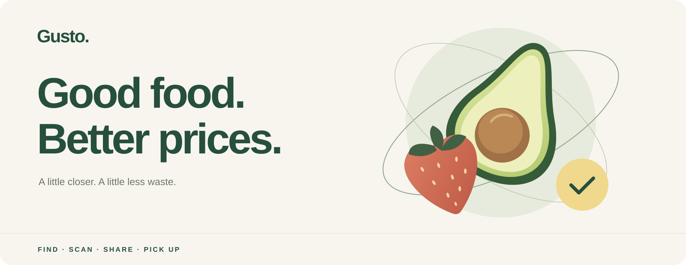
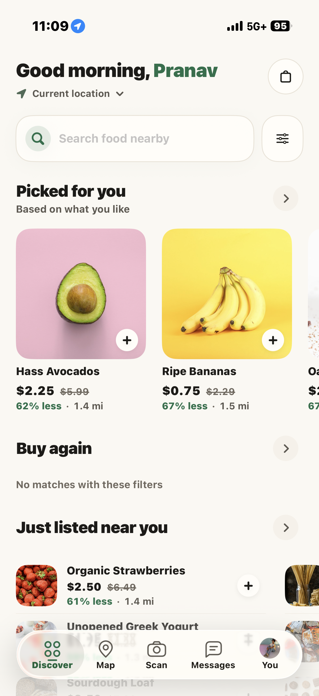
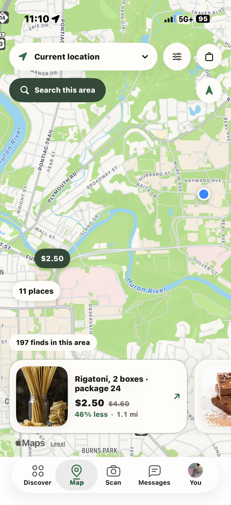
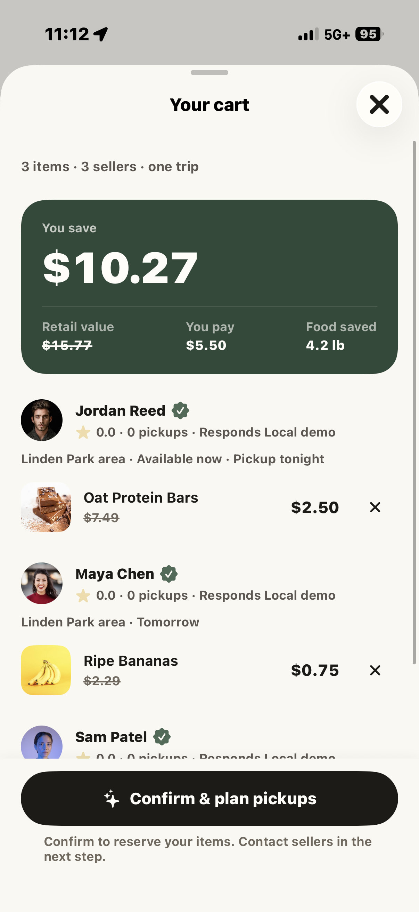
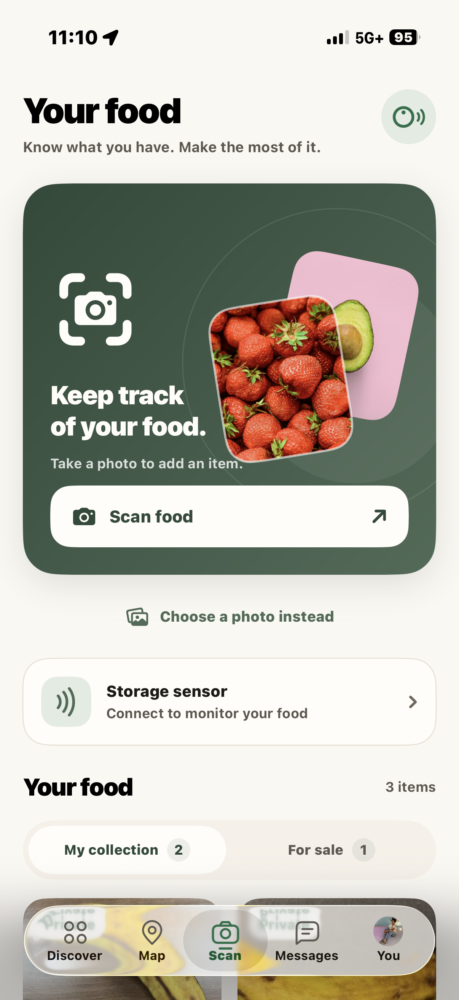
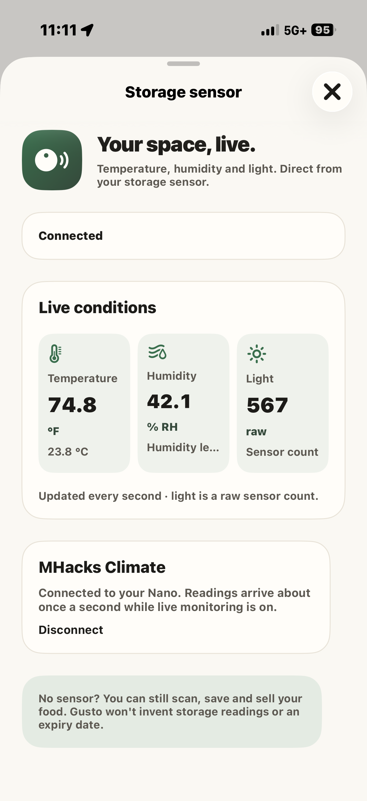
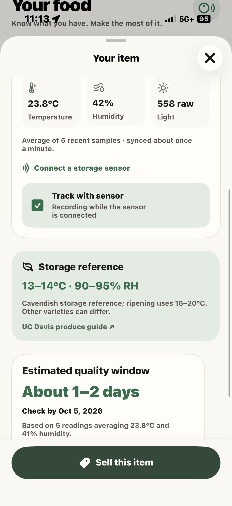
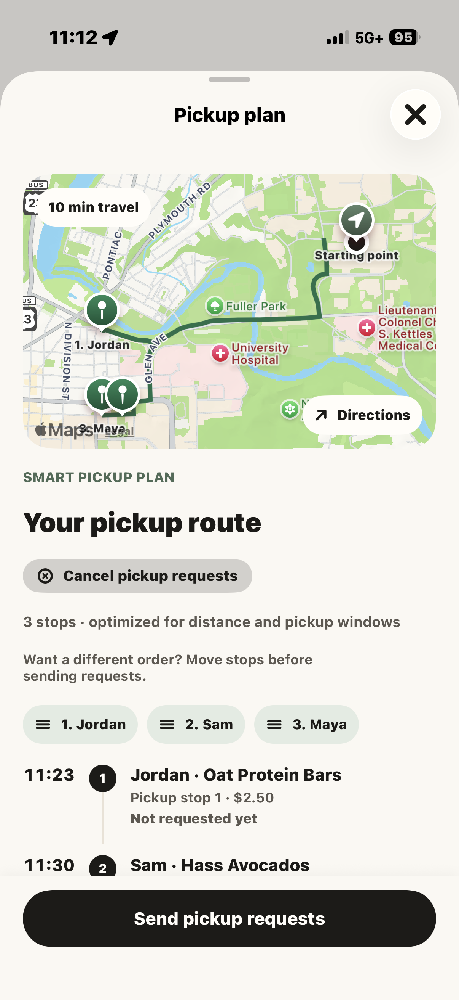

  

  <strong>Good food deserves another chance.</strong> 
  Find it nearby. Keep track of yours. Make the pickup worth the trip.

  <strong>Native iPhone app</strong> &nbsp;·&nbsp; Gemini photo scanning &nbsp;·&nbsp; Connected storage &nbsp;·&nbsp; Shared marketplace

  <a href="#find-something-good">Discover</a> &nbsp;/&nbsp;
  <a href="#know-what-you-have">Scan &amp; track</a> &nbsp;/&nbsp;
  <a href="#several-sellers-one-trip">Pickups</a> &nbsp;/&nbsp;
  <a href="#the-stack">The stack</a>

 

## Find something good

**Food worth picking up, at a price worth taking.** Browse the neighborhood, compare savings, and build your next pickup.

<table>
  <tr>
    <td align="center" width="33%"> <strong>Your neighborhood, on the menu.</strong></td>
    <td align="center" width="33%"> <strong>Good finds around the corner.</strong></td>
    <td align="center" width="33%"> <strong>See the savings before you go.</strong></td>
  </tr>
</table>

| Discover | Make it yours |
| :--- | :--- |
| Recommendations, recent listings, snacks, and deals | Search by food; filter by budget, distance, pickup time, and preferences |
| Apple Maps price pins and listing previews | Use GPS, choose an address, or search the visible map area |
| Current price, original value, savings, and distance | Save favorites, follow sellers, and group your cart by seller |

 

## Know what you have

**One photo starts your collection.** Gemini suggests the food, variety, visible condition, quantity, and storage details. Review, edit, and save privately.

<table>
  <tr>
    <td align="center" width="33%"> <strong>Scan it. Keep track of it.</strong></td>
    <td align="center" width="33%"> <strong>Your storage space, live.</strong></td>
    <td align="center" width="33%"> <strong>More context for every item.</strong></td>
  </tr>
</table>

- **Photo to collection.** Camera or photo library, suggested details, optional food crop, and manual entry.
- **Collection to marketplace.** Reuse your photo and details; choose a price, pickup location, and available window before publishing.
- **Connected storage.** Arduino Nano temperature, humidity, and raw light readings arrive over Bluetooth, with a companion FREE-WILi display.
- **Item-level history.** Link food to recorded conditions and view a provisional quality window. Scans and sensor history stay private until you choose to publish listing information.

Quality estimates are experimental and uncalibrated. They are not food-safety expiration dates.

 

## Several sellers. One trip.

<table>
  <tr>
    <td align="center" width="35%"></td>
    <td valign="top" width="65%">
      <h3>Make the stops work together.</h3>
      
<strong>Plan.</strong> Group food by seller, account for pickup windows, and adjust the stop order before sending requests.

      
<strong>Coordinate.</strong> Message sellers with the listing pinned. Use quick replies, request a Fresh Check, and agree on pickup times.

      
<strong>Pick up.</strong> Follow Apple Maps directions, announce arrival, wait for seller handoff, review the food, and complete demo payment.

      
<strong>See the result.</strong> Trip summaries, purchase and sales history, earnings, savings, food weight, and monthly impact charts.

      
Foreground message updates, unread badges, and banners keep the conversation moving.

    </td>
  </tr>
</table>

 

## The stack

| | Built with | Powers |
| :--- | :--- | :--- |
| **iPhone** | Swift · SwiftUI · Observation | Native screens, shared state, sheets, and haptics |
| **Maps** | MapKit · Core Location | Nearby food, address search, price pins, and road directions |
| **Intelligence** | Google Gemini | Reviewed food suggestions and photo crop bounds |
| **Database** | TypeScript · SpacetimeDB · Maincloud | Listings, private inventory, chat, reservations, and receipts |
| **Identity** | SpacetimeAuth · Google · Keychain | Sign-in, OAuth with PKCE, protected sessions, and renewal |
| **Hardware** | Core Bluetooth · Arduino Nano 33 BLE Sense Rev2 · FREE-WILi | Climate readings, storage history, and the companion display |
| **Core** | GustoCore · Swift Concurrency · URLSession · Swift Charts | Product rules, networking, caching, and impact |
| **Testing** | Swift Package tests · XCTest · XCUITest · TypeScript integration tests | Core logic, iPhone flows, access controls, and transactions |

iOS 17+ · No third-party Swift packages · Dynamic Type · VoiceOver · Reduce Motion

<strong>Engineering details</strong>

 

- **Server-controlled reservations.** Cart confirmation claims inventory; conflicting holds, expiry, cancellation, and handoff are checked on the backend.
- **Completion happens once.** Guarded pickup phases and deduplicated payment retries prevent extra receipts.
- **Private by default.** Account-scoped records, sessions, caches, and pending work keep users' data separate.
- **Secrets stay on the server.** Gemini analysis runs through an authenticated procedure; the API key is absent from the app.
- **One flow, one source of truth.** A shared product store and root sheet host preserve context across listings, cart, plans, and chat.
- **Impact follows receipts.** Completed pickups count; skipped food and unknown prices or weights are never filled in with invented values.
- **Foreground synchronization.** Marketplace and conversation updates use HTTP polling; a separate fixture mode supports offline walkthroughs.

<strong>Project map and technical docs</strong>

 

| Project | Responsibility | Explore |
| :--- | :--- | :--- |
| `Gusto/` | Native app and design system | [Design](DESIGN.md) |
| `Sources/GustoCore/` | State, models, networking, and pickup rules | [Architecture](ARCHITECTURE.md) |
| `GustoDatabase/` | Authenticated backend and tooling | [Database](GustoDatabase/README.md) · [API contract](docs/backend/CONTRACT.md) |
| `GustoHardware/` | Sensor and display firmware | [Hardware](GustoHardware/README.md) · [Bluetooth protocol](GustoHardware/BLE_PROTOCOL.md) |
| `Tests/` | Core, backend, and iPhone validation | [Testing](docs/TESTING.md) |

[Gemini scanning](docs/GEMINI_SCAN_SETUP.md) · [iPhone guide](docs/IPHONE_SENSOR_SETUP.md)

 

> **Prototype status:** Cloud accounts, shared listings, scanning, messaging, pickup coordination, and sensor integration are implemented. Payments are simulated; background push is not connected. The sample catalog includes fictional sellers and locations.

<strong>Good food. Better prices. More on your table.</strong>

