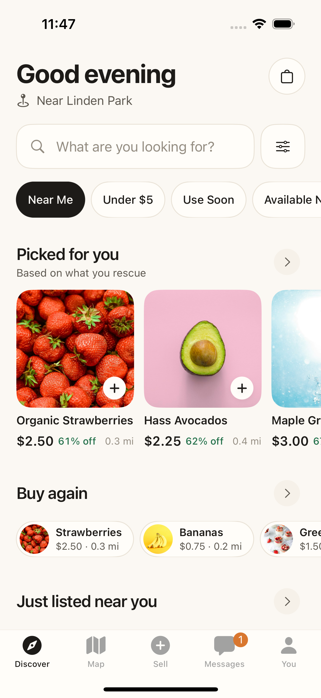
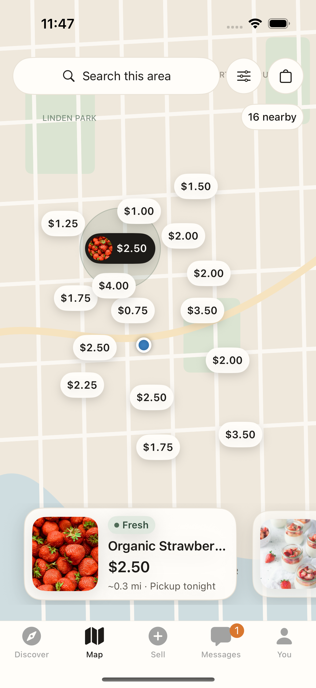
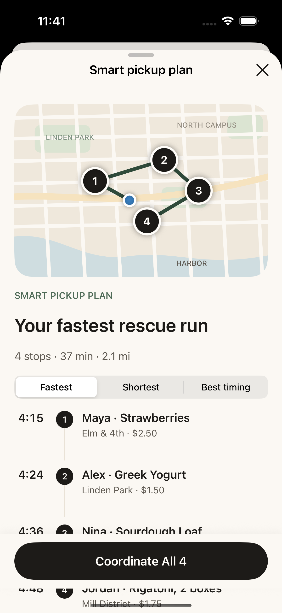

  

  <strong>Find something good. Give it another chance.</strong> 
  A neighborhood food marketplace with photo scanning, connected storage, and pickups that fit your day.

  <a href="#the-experience">The experience</a> &nbsp;·&nbsp;
  <a href="#under-the-hood">The stack</a> &nbsp;·&nbsp;
  <a href="#built-with-care">The engineering</a> &nbsp;·&nbsp;
  <a href="#a-closer-look">Explore the project</a>

 

Good food gets left behind. A few extra groceries, produce you won't finish, something worth sharing. Gusto connects that food with someone nearby who wants it, at a price that makes the pickup worth taking.

The whole exchange lives in one native iPhone app: discover a listing, talk to the seller, plan your stops, check the food at pickup, and see what you saved. On the other side, turn a photo into a private collection item, track its storage conditions, and list it when you're ready.

## The experience

<table>
  <tr>
    <td align="center" width="33%"></td>
    <td align="center" width="33%"></td>
    <td align="center" width="33%"></td>
  </tr>
  <tr>
    <td align="center"><strong>Find your next good deal</strong></td>
    <td align="center"><strong>See what's around you</strong></td>
    <td align="center"><strong>Make one trip count</strong></td>
  </tr>
</table>

Original design previews. The current app adds the Scan tab, cloud accounts, and connected storage.

### A better way to browse nearby

Discover brings together food photography, prices, savings, and distance in a feed built for browsing. Explore recommendations, recent listings, snacks, and deals, or search for exactly what you need.

- **Find your fit.** Combine category, budget, distance, pickup time, freshness, and food preferences. Search and active filters switch the feed into a focused results gallery.
- **Shop the neighborhood.** Browse Apple Maps price pins, seller clusters, and a synchronized listing carousel. Move the map and search that area.
- **Choose your starting point.** Use your current location or search for a city, neighborhood, or address. Nearby results and distances follow your choice.
- **Keep your favorites close.** Save listings and follow sellers, with preferences attached to your account.

### From a photo to your food collection

Take a photo or choose one from your library. Gemini suggests the food, variety, category, visible condition, quantity, and storage information. Review and edit the details before saving; confident food bounds offer a tighter crop, with the full photo always recoverable.

Your collection stays private. Scanning an item doesn't list it for sale. When you're ready, **Sell this item** carries its photo and reviewed details into a listing editor. Add a price, allergens, pickup location, and availability, then publish to the shared marketplace. Manual entry is available when analysis can't complete.

### Storage you can actually see

Connect an **Arduino Nano 33 BLE Sense Rev2** to Gusto over Bluetooth and watch temperature, relative humidity, and raw ambient-light readings update in the storage dashboard. A companion **FREE-WILi** display shows the same measurements and controls Bluetooth discovery.

Link collection items to the sensor to record private storage history. Recent temperature and humidity readings support a provisional remaining-quality estimate; published items can carry a summary of their recorded storage conditions.

Missing or stale readings are shown honestly. Quality estimates are experimental and uncalibrated; they do not establish a food-safety expiration date.

### Conversations that stay with the food

Seller chats keep the relevant listing pinned, so the item and the conversation stay together. Ask a question, use a quick reply, coordinate a pickup window, or request a **Fresh Check** so the seller can reconfirm the item's condition.

Incoming messages and pickup updates refresh while the app is open. Inbox previews, unread badges, and dismissible banners surface activity, including while you're viewing a listing or cart. Returning from chat takes you back to the flow you came from.

### Several sellers. One pickup plan.

Add food to your cart while you browse. Nothing is held and no seller is contacted until you explicitly confirm the plan.

Gusto groups items by seller and offers **Fastest**, **Shortest**, and **Best timing** route preferences. Review the stop order, adjust it before sending requests, and coordinate with sellers through Messages. An agreed time change shifts later stops so the timeline stays useful.

Once sellers confirm, your pickup trip is accessible from Discover, the cart, and seller chat. Apple Maps provides road directions. Arrival, seller handoff, food review, and demo payment form a guided sequence at each stop. You can report an issue or cancel pickup requests, with server rules protecting reservations and completion.

### See what each pickup adds up to

Finished trips show the items collected, seller totals, money saved, and food weight. Your profile brings together purchase and sales history, earnings, and monthly impact charts.

Totals come from completed receipts and the listing data behind them. Skipped pickups don't count, and missing original prices or weights aren't guessed. The result is a record of what you actually completed.

### Made for the iPhone

Ivory surfaces, deep sage, butter accents, generous photography, and rounded typography give Gusto its visual identity. Native tabs, sheets, photo picking, maps, sharing, and haptics carry it through the app. Dynamic Type, VoiceOver, Reduce Motion, and generous touch targets are part of the design.

## Under the hood

| Layer | Technology | What it does |
| :--- | :--- | :--- |
| iPhone app | **Swift, SwiftUI, iOS 17+** | Native screens, navigation, sheets, and interaction; no third-party Swift packages |
| Product state | **Observation, Swift Concurrency, GustoCore** | Shared observable state, async work, pickup planning, money, and guarded transitions |
| Maps and location | **MapKit, Core Location** | Nearby discovery, address search, seller pins, and road directions |
| Accounts | **SpacetimeAuth, Google sign-in, Keychain** | OAuth with PKCE, authenticated profiles, protected sessions, and token renewal |
| Shared backend | **TypeScript, SpacetimeDB on Maincloud** | Private tables, authenticated HTTP procedures, marketplace search, reservations, messages, and receipts |
| Photo analysis | **Google Gemini** | Structured food suggestions and crop bounds through an authenticated server call |
| Connected storage | **Core Bluetooth, Arduino, FREE-WILi** | Live sensor notifications, item-linked history, and a companion hardware display |
| Data and charts | **URLSession, actor-backed caches, Swift Charts** | Cloud transport, account-scoped cached data, retryable messages, and receipt-based impact |
| Verification | **Swift Package tests, XCTest, XCUITest, TypeScript integration tests** | Core rules, Simulator flows, backend access controls, and transaction behavior |

The app talks to authenticated backend procedures through its Swift repository layer. Gemini runs behind the server, with its key kept out of the iPhone app. Sensor readings arrive over Bluetooth and are saved as private, item-linked history. Marketplace and conversation updates use foreground HTTP polling.

## Built with care

- **Private until you publish.** Food scans and sensor history belong to your account. Publishing is a separate, explicit action.
- **Reservations that hold up.** Cart confirmation creates server-controlled inventory holds. Conflicting claims, expiry, cancellations, and seller confirmations are checked on the backend.
- **Completion that happens once.** Pickup phases are guarded and payment retries are deduplicated, preventing repeated taps from creating extra receipts.
- **Accounts kept separate.** Sessions, cached data, and pending work are scoped to the account and environment. Switching accounts clears the previous user's active state.
- **A flow that keeps its place.** One shared product store and one root sheet host keep listings, cart, pickup plans, and chat in context.

## What's connected today

Gusto is a working prototype with cloud accounts, shared listings, Gemini scanning, private inventory, messaging, pickup coordination, and Bluetooth sensor integration. A separate fixture mode provides a repeatable offline walkthrough with bundled photos and local replies.

**Payments are simulated and never charge money.** Notifications arrive in the foreground; background push delivery is not connected. The sample catalog includes fictional sellers and locations. Sensor estimates describe provisional quality, and buyers review the food at handoff.

## A closer look

| Explore | Read |
| :--- | :--- |
| Visual identity and native interaction | [Design](DESIGN.md) |
| State ownership, data flow, and product rules | [Architecture](ARCHITECTURE.md) |
| Backend procedures and account boundaries | [API contract](docs/backend/CONTRACT.md) |
| Photo analysis and collection-to-sale flow | [Gemini scanning](docs/GEMINI_SCAN_SETUP.md) |
| Climate hardware and Bluetooth protocol | [Hardware](GustoHardware/README.md) · [BLE protocol](GustoHardware/BLE_PROTOCOL.md) |
| Test coverage and validation | [Testing](docs/TESTING.md) |
| Device installation and local development | [iPhone guide](docs/IPHONE_SENSOR_SETUP.md) · [Backend guide](GustoDatabase/README.md) |

 

<strong>Good food. Better prices. More on your table.</strong>

