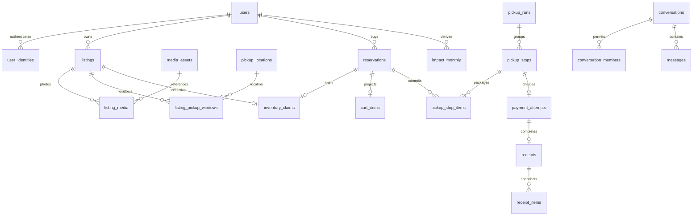

# Authorized database boundary (API v1)

The iOS 17 app uses URLSession against SpacetimeDB 2.10.2. All base tables are private;
only registered users can call product projections. The publishing identity is captured
by `init` in `database_owner`; database identity and database owner are different principals.

## HTTP serialization verified against 2.10.2

`POST /v1/database/mhacksdb/call/api`, `Authorization: Bearer <identity endpoint token>`.
Procedure names and schema object fields are snake_case. Arguments are positional JSON arrays:

```json
[{"action":"reserve","operation_id":"uuid","resource_id":"straw","text":"","version":0,"value":0,"enabled":false,"cursor":""}]
```

The response product is `[1, server_epoch_ms, error_code, payload_json_string]`.
Scheduled expiry uses the numeric primary key required by SpacetimeDB in `claim_expiry_tasks`;
`scheduled_tasks` retains compatibility with earlier local development records.
The Swift adapter also accepts the named product representation. `payload` contains a
versioned domain projection, decoded into concrete Codable DTOs by AppStore. No table SQL
is used by the app. This single procedure dispatches the actions below; action-specific
values in `text` are structured JSON, validated inside the transaction. This is deliberately
one stable transport envelope rather than one procedure for each screen.

Errors: `unauthorized`, `not_found`, `unavailable`, `expired`, `stale_version`,
`invalid_transition`, `service_unavailable`, `rate_limited`. Missing/invalid bearer tokens
can fail at HTTP authentication before an envelope is returned. Trusted-service and owner
procedure failures are HTTP failures. No successful status is fabricated on a transport error.

| Actions | Resource / arguments | Actor / result |
|---|---|---|
| bootstrap | none | Current profile, preferences, own cart/run/history, permitted sellers/conversations |
| feed, search, map | text = query/filter JSON, cursor, value = limit | Registered sessions; public listings/coarse locations |
| detail | listing ID | Published listing or owner's draft |
| reserve, release | listing ID | Actor's cart; reserve uses exclusive claim |
| draft, edit, attach_demo_media, analysis, publish, archive | listing ID, expected version; edit/safety JSON | Owner; demo photo copy requires simulation configuration |
| freshness, respond_freshness | listing/request ID | Registered requester / owning seller |
| plan, coordinate, start, finish | route mode / run ID | Buyer only |
| confirm | stop ID | Seller only; booking lasts through window + 15 minutes |
| schedule, accept_schedule | stop/change ID, proposed epoch ms in text | Participants; proposer cannot accept own change |
| arrive, announce, verify, advance, issue, cancel | stop ID | Buyer transitions, server guards |
| handoff | stop ID | Seller only |
| payment | stop ID | Buyer request; server amount from reservations |
| send, messages, mark_read | other user or conversation ID; text/sequence | Members only; direct pair membership is server-created |
| favorite, follow, preferences, profile, history, rate | desired state / version / receipt | Current user; ratings require own completed receipt |
| seller_activity | none | Only that seller's stops, freshness requests and own analysis jobs |
| media | media ID | Public media or owner; draft media remains owner-only |
| enroll_card, redeem_referral, register_push, verify_account | deferred | `service_unavailable` |

Every write needs a unique client operation ID. `(actor, operation ID)` stores an exact
request fingerprint and result in the same transaction. Identical retries return the
original result; changed arguments fail. Buyer/seller/sender IDs cannot be supplied as
authorization. Rate limits bound each application actor to 240 requests/minute.

## Relationships



All tables are in `GustoDatabase/spacetimedb/src/schema.ts`. IDs are stable strings allocated by a persistent transactional sequence (deterministic strings for seed data). Money and weights are integer cents/grams;
stored UTC times are u64 milliseconds. JSON converts safe-range times into numeric values.
Coordinates are deliberately coarse public doubles and private exact doubles. Primary keys,
unique claims/payment-per-stop/payment-per-receipt constraints, and transactional relationship
checks enforce consistency; there is no assumption of SQL foreign-key enforcement.

## Access matrix

| Data | Reader | Writer |
|---|---|---|
| Published listing / coarse seller location | Registered sessions | Seller |
| Draft / private media / analysis | Owner | Owner / authorized analysis service |
| Exact address / instructions | Seller, confirmed buyer with unexpired claim | Seller data; current phase uses seed locations |
| Cart / favorites / preferences / follows | Actor | Actor |
| Conversation / messages | Members | Member sender |
| Run | Buyer | Allowed buyer transitions |
| Stop | Buyer and that seller | Actor-specific transitions |
| Receipt | Buyer and seller | Payment service; owner seed installation |
| Impact | Actor | Derived from completed receipts |
| Verification / provider references | Intended actor projection | Future trusted provider; no user mutation |
| Seed / local configuration / identity provisioning | Database owner tooling | Database owner |

Direct SQL/subscriptions cannot expose private base tables to normal users. Owner credentials
never enter the app. `/dev/accounts` is an explicit loopback development endpoint; it distributes
only already provisioned local demo sessions and must never be hosted or port-forwarded.
It is not authentication for a production deployment.

## State transitions and idempotence

Held reservation (30 minutes) → seller confirmation → booked (window end + 15 minutes) → paid.
Release/expiry/cancellation removes the unique claim. Expiry is checked synchronously before
relevant transitions; scheduled expiry is maintenance, not the correctness boundary. Confirmation
reschedules the maintenance task. Cart edits invalidate draft plans; active runs lock cart edits.

Draft run → waiting confirmations → confirmed stops → active.
`enroute → arrived → waiting → verifying → payment → paying → rescued`.
Only the seller supplies `handoff` between waiting/verifying. Only the buyer supplies verification.
The explicit local simulator uses those seller identities, rather than a buyer-side fake response.
Advance follows payment, or an issue skips the current stop. Cancellation releases all unpaid
claims. Neither cancellation nor skipping creates impact.

Payment requests calculate amounts from committed reservations. Only a separate authorized
payment identity can complete them. Completion atomically writes one receipt and immutable item
snapshots, sells inventory, removes cart items and updates demo monthly impact/seller earnings.
A duplicated successful callback returns the existing result. Failed attempts can be requested
again; receipts and paid inventory remain protected by phase and unique constraints.

## Deferred boundaries and current limits

Real login/linking, camera/photo selection, cloud upload, AI, verification, cards, referrals,
push, and directions require future providers. Typed Swift protocols live in `Repository.swift`.
The database stores prepared records; unavailable integrations do not claim success. Local media
copy and scan are explicitly demo operations. The sell flow currently publishes a manually approved
local demo location and one of the existing typed pickup-window presets. The server validates UTC start/end times; arbitrary address/window editing remains unavailable.
Private chat photo sharing and pickup-photo upload are not enabled.

The current server planner groups by seller/location, uses coarse straight-line distance and
15 mph estimates, and bounds plans to available windows. Shortest and fastest can coincide under
that travel estimate. Best timing uses closing windows. Schedule acceptance shifts downstream
stops and removes confirmation when a window no longer fits; extending a window is unavailable.

## Cloud registration

`register_profile` takes one positional string argument, the SpacetimeAuth ID token,
and the same token in the HTTP Authorization bearer header. The procedure verifies
the token/caller pair through the fixed Maincloud identity verification endpoint outside
the transaction, then requires the Gusto issuer, project, audience and unexpired token.
The token is never logged or stored in product tables. New registrations atomically create
`users`, `user_identities`, `user_preferences`, `carts`, `seller_stats` and
`notification_preferences`. Repeated calls return the existing active user ID. Disabled
accounts are not reactivated. The result uses the API v1 envelope with `{userId}` payload.
HTTP calls in SDK 2.10 do not expose JWT claims through `senderAuth`, hence the explicit
verified token argument; unverified client-supplied IDs/claims never authorize registration.
